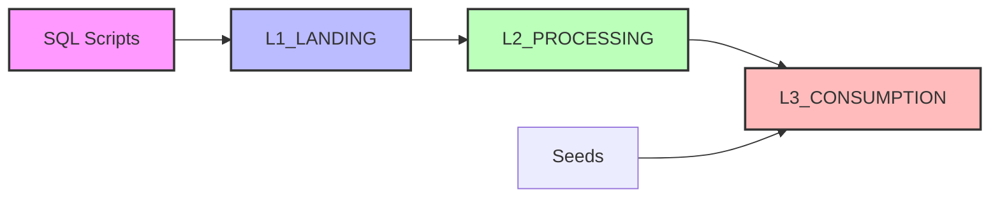

# 🛒 SLEEKMART - Order Management System
# Project: End-to-End Analytics Pipeline Using dbt + Snowflake

## 📋 Table of Contents
- [Project Overview](#project-overview)
- [Project Structure](#project-structure)
- [Database Architecture](#database-architecture)
- [Key Models](#key-models)
- [Getting Started](#getting-started)
- [Usage](#usage)

## 🎯 Project Overview

SLEEKMART is an end-to-end data analytics solution for a retail order management system. The project implements a modern data warehouse architecture with three distinct layers (Landing, Processing, Consumption) using dbt for transformations and Snowflake as the data warehouse.

## 📁 Project Structure
```
sleekmart_project/
│
├── 📄 dbt_project.yml              # dbt project configuration
├── 📄 profiles.yml                 # Connection settings (gitignored)
├── 📄 README.md                    # Project documentation
├── 📄 .gitignore                   # Git ignore rules
├── 📄 LICENSE
│
├── 📂 macros/                      # Custom Jinja macros
│   ├── .gitkeep
│   └── generate_schema_name.sql
│
├── 📂 models/                      # dbt models (SQL transformations)
│   ├── sources.yml                # Source table definitions
│   ├── schema.yml                 # Model documentation & tests
│   │
│   ├── 📂 staging/                # L2_PROCESSING - Staging layer
│   │   ├── amount_stg.sql
│   │   ├── customerorders_stg.sql
│   │   ├── customers_stg.sql
│   │   └── orders_stg.sql
│   │
│   └── 📂 marts/                  # L3_CONSUMPTION - Analytics layer
│       ├── actualsales.sql
│       ├── completedorders_fact.sql
│       ├── customerrevenue.sql
│       └── storeperformance.sql
│
├── 📂 seeds/                       # CSV reference data
│   ├── .gitkeep
│   └── targetsales.csv
│
├── 📂 tests/                       # Custom data quality tests
│   ├── .gitkeep
│   └── amount_stg_negative_check.sql
│
├── 📂 snapshots/                   # SCD Type 2 snapshots
│
├── 📂 sql_files/                   # Raw data generation scripts
│   ├── customers.sql              # Customer dimension data
│   ├── dates.sql                  # Date dimension data
│   ├── employees.sql              # Employee dimension data
│   ├── initialise.sql             # Database initialization script
│   ├── orderitems.sql             # Order items fact data
│   ├── orders.sql                 # Orders fact data
│   ├── products.sql               # Product dimension data
│   ├── stores.sql                 # Store dimension data
│   └── suppliers.sql              # Supplier dimension data
│
└── 📂 target/                      # Compiled SQL & artifacts (gitignored)
```

## 🗄️ Database Architecture

### Three-Layer Architecture
```
┌─────────────────────────────────────────────┐
│          L1_LANDING (Raw Data)              │
│  ─────────────────────────────────────────  │
│  • L1_CUSTOMERS                             │
│  • L1_ORDERS                                │
│  • L1_ORDERITEMS                            │
│  • L1_PRODUCTS                              │
│  • L1_SUPPLIERS                             │
│  • L1_STORES                                │
│  • L1_EMPLOYEES                             │
│  • L1_DATES                                 │
└──────────────────┬──────────────────────────┘
                   │
                   ↓
┌─────────────────────────────────────────────┐
│      L2_PROCESSING (Staging & Transform)    │
│  ─────────────────────────────────────────  │
│  • customers_stg                            │
│  • orders_stg                               │
│  • amount_stg                               │
│  • customerorders_stg                       │
└──────────────────┬──────────────────────────┘
                   │
                   ↓
┌─────────────────────────────────────────────┐
│   L3_CONSUMPTION (Analytics-Ready Tables)   │
│  ─────────────────────────────────────────  │
│  • actualsales                              │
│  • storeperformance                         │
│  • customerrevenue                          │
│  • completedorders_fact                     │
└─────────────────────────────────────────────┘
```

### Data Flow


## 📊 Key Models

### Staging Layer (L2_PROCESSING)
- **customers_stg** - Cleaned and organized customer information
- **orders_stg** - Cleaned order details
- **amount_stg** - Calculated product amounts (quantity × unit price)
- **customerorders_stg** - Combined view of customer and order details

### Marts Layer (L3_CONSUMPTION)
- **actualsales** - All sales transactions in one fact table
- **storeperformance** - Key metrics showing each store’s performance
- **customerrevenue** - Total revenue generated by each customer
- **completedorders_fact** - Detailed list of all completed orders

## 🚀 Getting Started

### Prerequisites

- Python 3.8+
- Snowflake account
- Git

### Installation

1. **Clone the repository**
```bash
   git clone   git clone https://github.com/yourusername/sleekmart_project.git
   cd sleekmart_project
```

2. **Create virtual environment**
```bash
   python -m venv dbt_env
   
   # Windows
   dbt_env\Scripts\activate
   
   # Mac/Linux
   source dbt_env/bin/activate
```

3. **Install dependencies**
```bash
   pip install dbt-snowflake
```

4. **Configure profiles**
   
   Create `~/.dbt/profiles.yml`:
```yaml
   sleekmart_project:
     outputs:
       dev:
         account: your_account.region.provider
         database: SLEEKMART_OMS
         user: your_username
         password: your_password
         role: accountadmin
         warehouse: COMPUTE_WH
         schema: L3_CONSUMPTION
         threads: 1
         type: snowflake
     target: dev
```

5. **Initialize database**
   
   Run the SQL scripts in `sql_files/` in Snowflake:
```sql
   -- Run in this order:
   1. initialise.sql      -- Creates database and schemas
   2. customers.sql       -- Loads customer data
   3. dates.sql          -- Loads date dimension
   4. employees.sql      -- Loads employee data
   5. products.sql       -- Loads product data
   6. suppliers.sql      -- Loads supplier data
   7. stores.sql         -- Loads store data
   8. orders.sql         -- Loads order headers
   9. orderitems.sql     -- Loads order line items
```

6. **Test connection**
```bash
   dbt debug
```

## 💻 Usage

### Run All Models
```bash
dbt run
```

### Run Specific Layers
```bash
# Staging layer only
dbt run --select staging.*

# Marts layer only
dbt run --select marts.*
```

### Run Specific Model
```bash
dbt run --select actualsales
dbt run --select storeperformance
```

### Run Tests
```bash
# All tests
dbt test

# Source data tests
dbt test --select source:*

# Model tests
dbt test --select amount_stg
```

### Generate Documentation
```bash
# Generate and serve docs
dbt docs generate
dbt docs serve
```

### Common Commands
```bash
# Full refresh (rebuild all tables from scratch)
dbt run --full-refresh

# Run models with their downstream dependencies
dbt run --select actualsales+

# Run models with their upstream dependencies
dbt run --select +actualsales

# Compile without running
dbt compile

# Clean generated files
dbt clean
```

## 🧪 Data Quality Tests

The project includes custom data quality tests:

- **amount_stg_negative_check** - Ensures no negative amounts in calculations
- **Uniqueness tests** - Ensures primary keys and customer information is unique
- **Not null tests** - Validates required fields

## 📈 Key Metrics & KPIs

### Store Performance
- Total sales by store
- Sales vs. target achievement percentage
- Store-level revenue trends

### Customer Analytics
- Customer lifetime value
- Revenue per customer
- Customer order frequency

### Sales Analysis
- Total sales by product category
- Order completion rates
- Average order value

## 🛠️ Technology Stack

- **Data Warehouse**: Snowflake
- **Transformation Tool**: dbt (Data Build Tool)
- **Version Control**: Git
- **Languages**: SQL, Jinja

## 📝 Project Configuration

### dbt_project.yml
```yaml
models:
  sleekmart_project:
    staging:
      +schema: l2_processing
      +materialized: view
    
    marts:
      +schema: l3_consumption
      +materialized: table
```

## 🤝 Contributing

1. Fork the repository
2. Create a feature branch (`git checkout -b feature/AmazingFeature`)
3. Commit your changes (`git commit -m 'Add some AmazingFeature'`)
4. Push to the branch (`git push origin feature/AmazingFeature`)
5. Open a Pull Request

## 📄 License

This project is licensed under the MIT License - see the [LICENSE](LICENSE) file for details.

## 👤 Author

**Your Name**
- GitHub: [@PriscillaJoan](https://github.com/priscillajoan)


For questions or feedback, please reach out via [email@joanpriscillanjoroge.com](mailto:email@joanpriscillanjoroge.com)

---

**Built with ❤️ using dbt and Snowflake**

